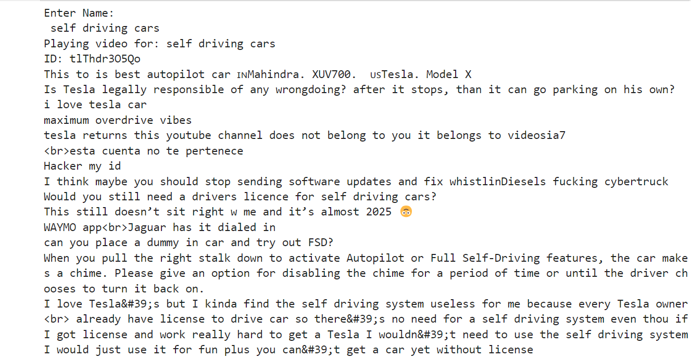
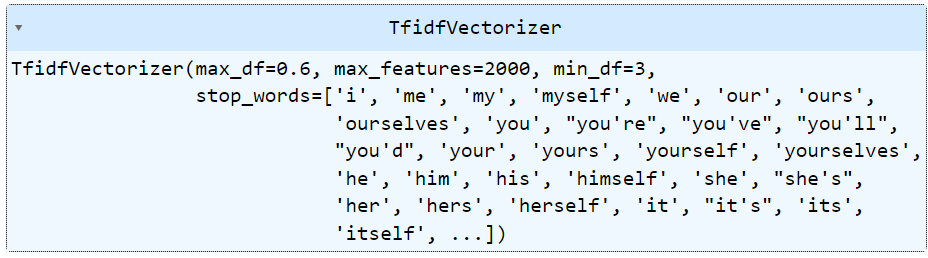
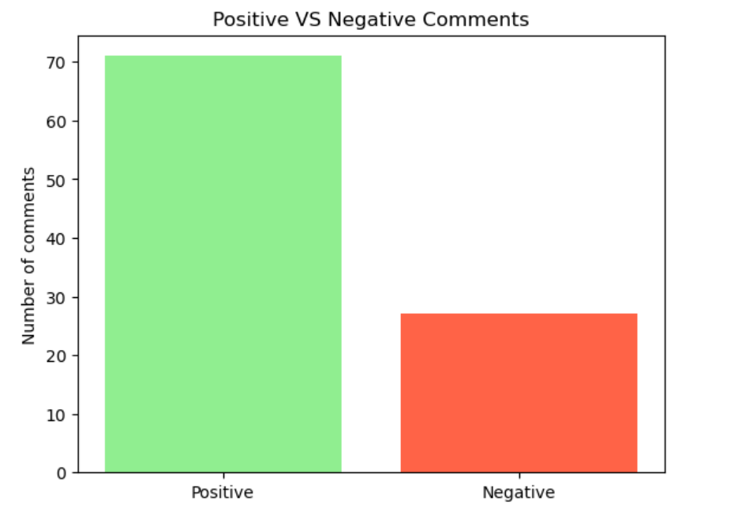

<h1>Youtube Sentiment Analysis</h1>
This Natural Language Processing project allows us to get a comparison between the positive and negative comments of any YouTube video using YouTube Data API v3.
<h3>Technologies used</h3>
<ul>
  <li>Python- 3.11.3</li>
  <li>IDE- JupyterLab 3.6.3</li>
  <li>Libraries used-</li>
  <ul>
    <li>re</li>
    <li>pickle</li>
    <li>YoutubeSearch</li>
    <li>matplotlib</li>
  </ul>
  <li>TF-IDF Vectorizer</li>
  <li>Logistic Regression</li>
</ul>
<h2>Using YoutubeSearch to search for any youtube video and then extracting the first 100 comments using YouTube Data API v3.</h2>

<h2>The comments are cleaned using Regular Expressions and converted to vectors using TF-IDF Vectorizer.</h2>

<h2>Finally using Logistic Regression to classify the comments into positive and negative sentiments.</h2>

